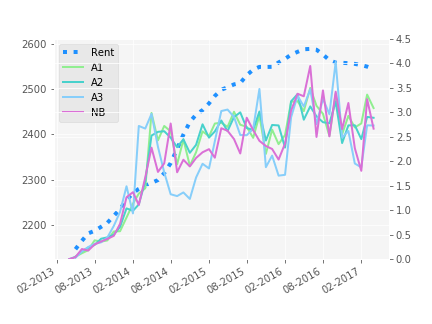
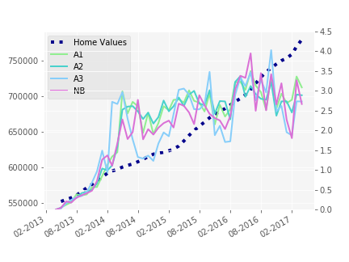
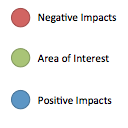

Rent or Buy
-----------

The goal of my Insight project was to create a web app <http://www.rentorbuy.press> that helps users navigate the NYC residential real estate market based on permits information. The permits data is available from <https://data.cityofnewyork.us/Housing-Development/DOB-Permit-Issuance/ipu4-2q9a> and the home values and rents data is available from Zillow <https://www.zillow.com/research/data/>. The project can be divided into three parts. The first part of the project was to understand the causal impacts of permits on rents or home values, or vice versa. The second was to incorporate permits information into a predictive model. Finally, we tried to understand, which permits, if any, affect home values and rents.

 

As we can see from the plots above, the data is non-stationary. There is a clear trend in the data. We take first differences to try and deal with this, which seems to take care of the issue. In addition, to determine the number of autoregressive terms we do choose the one that minimizes the log likelihood. In this case, it turns out to be 2.

For the first part, we used the concept of Granger causality <https://en.wikipedia.org/wiki/Granger_causality> for time series. This is a statistical test for determining whether one time series is helpful in forecasting another. However, this is a method for univaritate time series, so I used a Singular Value Decomposition for dimensionality reduction and ran the Granger test on the principal eigenvectors.

| Predictor | Response | F    |
|:----------|:---------|:-----|
| Permits   | Rents    | 1.43 |
| Permits   | Prices   | 0.86 |
| Prices    | Permits  | 0.38 |
| Rents     | Permits  | 0.15 |

The table clearly indicates that the probability that Permits have a causal effect on Home values and Rents is much higher than the other way round.

For the predictive modeling we are interested in leveraging both home values and rent information as well as permits data from all neighborhoods. Thus we use an L1 regularized Vector Autoregressive model (VAR), a Bayesian Autoregressive model (BAR) with a horseshoe prior <http://proceedings.mlr.press/v5/carvalho09a/carvalho09a.pdf>, a Recurrent Neural Network (RNN) with an LSTM layer and compared them Facebook's Prophet <https://facebookincubator.github.io/prophet/>. For the VAR, RNN and BAR models we used 2 autoregressive terms.

In this case, it turns out that the simplest model - the ℓ1-VAR has the best performance in terms of predictive ability. However, in terms of model selection though, we have a slightly different scenario.

The pupose of model selection is to understand which permits have the biggest impacts on rents and home values. Any non-zero coefficient from our VAR and BAR indicates an effect on home values and rents. To figure out what permits have the largest effects we look at the largest coeffcients. The green dot shows the area we are interested in (in this case 10010, the zip code where Insight's office is located). The blue dots show the largest positive impacts, while the red dots show the largest negative impacts. The Bayesian verson (below on the left) looks more plausible simply because the point are clustered closer together. A word of warning about the Frequntist method (below on the right): we should be cautious in out interpretation ,despite asymptotic guarantees of convergence <https://arxiv.org/pdf/1311.4175.pdf>, due to limited data. In additon, Bayesian methods usually work better with a small sample size.

  
