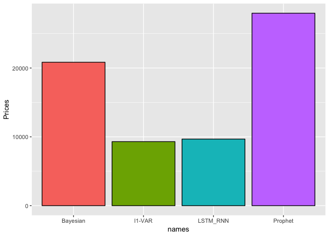

Insight
-------

The goal of my Insight project was to create a webapp
&lt;www.rentorbuy.press&gt; that helps users navigate the NYC
residential real estate martket based on permits information. The
permits data is available from
<https://data.cityofnewyork.us/Housing-Development/DOB-Permit-Issuance/ipu4-2q9a>
and the home values and rents data is available from Zillow
<https://www.zillow.com/research/data/>. The proejct can be divided into
three part. The first part of the project was to understand the causal
impacts of permits on rents or home values, or vice versa. The second
was to incorporate permits information into a predictive model. Finally,
we tried to understand, which permits, afftect home values and rents.

For the first part, we used the concept of granger causality
<https://en.wikipedia.org/wiki/Granger_causality> for time series. This
is a statistical test for determining whether onse time series is
helpful in forecasting another. However, this is a method for
univartiate time series, so I used a Singular Value Decompostion for
reduce the dimensionality and ran the granger test on the principal
eigenvectors.

<table>
<thead>
<tr class="header">
<th align="left">Predictor</th>
<th align="left">Response</th>
<th align="right">F</th>
</tr>
</thead>
<tbody>
<tr class="odd">
<td align="left">Permits</td>
<td align="left">Rents</td>
<td align="right">1.43</td>
</tr>
<tr class="even">
<td align="left">Permits</td>
<td align="left">Prices</td>
<td align="right">0.86</td>
</tr>
<tr class="odd">
<td align="left">Prices</td>
<td align="left">Permits</td>
<td align="right">0.38</td>
</tr>
<tr class="even">
<td align="left">Rents</td>
<td align="left">Permits</td>
<td align="right">0.15</td>
</tr>
</tbody>
</table>

The table clearly indicates that the probability that Permits have a
causal effect on Home values and Rents is much higher than the other way
round.

For the predictive modeling we are interested in leveraging both home
values and rent information as well as permits data from all
neighborhoods. Thus we use an ℓ1 regularized Vector
Autoregressive model (VAR), a Bayesian Autoregressive model (BAR) with a
horseshoe prior, a Recurrent Neural Network (RNN) with an LSTM layer and
compared them Facebook's Prophet
<https://facebookincubator.github.io/prophet/>. For the VAR, RNN and BAR
models we used 2 autoregressive terms. In addition, the model for the
BAR is as follow:
$$
\\begin{aligned}
y\_i &\\sim \\mathcal{N}(X\\beta,\\sigma) \\\\
\\beta\_i &\\sim \\mathcal{N}(0,\\lambda\_i \\tau) \\\\
\\tau &\\sim \\mathcal{C}^+(0,1) \\\\
\\lambda\_i &\\sim \\mathcal{C}^+(0,1)
\\end{aligned}
$$
 where *X* contains both lagged terms from home values/rents and permits
from all neighborhood.

Finally, we look at the non-zero estimates from our VAR and BAR outputs
to figure out what permits have the largest effects on home values and
rents. The plots below show the largest impactors on rents from the
Bayesian and Frequntist perspectives on our zip code at Insight. The
results are a bit whacky due to limited data, so I wouldn't read too
much into them, but here are the plots. The green dot shows the area we
are interested in. The blue dots show the largest postive impacts, while
the red dots show the largest negative impacts.

